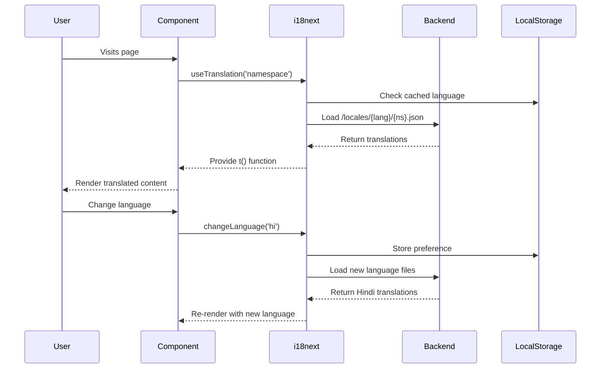
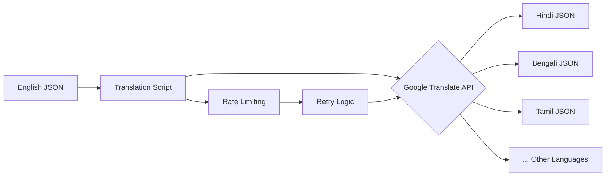

# 🌍 Translation System Architecture Documentation

**Version:** 1.0  
**Date:** 2025-08-17  
**System:** ATM Franchise India Multi-Language Support

## 📋 Table of Contents

1. [Executive Summary](#executive-summary)
2. [Architecture Overview](#architecture-overview)
3. [Technical Stack](#technical-stack)
4. [System Components](#system-components)
5. [Data Flow](#data-flow)
6. [Implementation Details](#implementation-details)
7. [Translation Pipeline](#translation-pipeline)
8. [Current Status](#current-status)
9. [Security Considerations](#security-considerations)
10. [Performance Implications](#performance-implications)
11. [Maintenance & Scalability](#maintenance-scalability)
12. [Recommendations](#recommendations)

---

## 1. Executive Summary

The ATM Franchise India application implements a multi-language translation system supporting 14 languages (English + 13 Indian regional languages). The system uses **i18next** for client-side translation management and **Google Cloud Translation API** for automated translation generation.

### Key Metrics:
- **Languages Supported:** 14 (en, hi, bn, ta, te, mr, gu, ur, kn, or, pa, as, ml)
- **Total Pages:** 27
- **Translation Files:** 16 JSON files per language
- **Current Translation Status:** 33% complete
- **Architecture Pattern:** Static JSON-based with lazy loading

---

## 2. Architecture Overview

```
┌─────────────────────────────────────────────────────────────────┐
│                         USER INTERFACE                           │
├─────────────────────────────────────────────────────────────────┤
│                     React Components                             │
│                  ┌──────────────────┐                           │
│                  │  useTranslation  │                           │
│                  │      Hook         │                           │
│                  └────────┬─────────┘                           │
├───────────────────────────┼─────────────────────────────────────┤
│                     i18next Core                                 │
│  ┌─────────────┐  ┌──────┴──────┐  ┌─────────────────┐        │
│  │  Language   │  │  Translation │  │   Fallback      │        │
│  │  Detector   │  │   Provider   │  │   Handler       │        │
│  └─────────────┘  └──────┬──────┘  └─────────────────┘        │
├───────────────────────────┼─────────────────────────────────────┤
│                   Translation Data Layer                         │
│  ┌─────────────────────────┴────────────────────────┐          │
│  │            Static JSON Files                      │          │
│  │  /public/locales/{lang}/{namespace}.json         │          │
│  └───────────────────────────────────────────────────┘          │
├─────────────────────────────────────────────────────────────────┤
│                  Translation Generation                          │
│  ┌──────────────┐  ┌──────────────┐  ┌──────────────┐        │
│  │   Node.js    │  │   Google     │  │   File       │        │
│  │   Scripts    │──│  Translate   │──│   System     │        │
│  │              │  │     API      │  │              │        │
│  └──────────────┘  └──────────────┘  └──────────────┘        │
└─────────────────────────────────────────────────────────────────┘
```

---

## 3. Technical Stack

### Frontend Libraries:
```json
{
  "i18next": "^24.2.0",
  "react-i18next": "^15.2.0",
  "i18next-browser-languagedetector": "^8.0.2",
  "i18next-http-backend": "^3.0.1"
}
```

### Backend/Build Tools:
```json
{
  "translation-scripts": "Node.js 18+",
  "google-translate-api": "v2",
  "vite": "^5.4.1"
}
```

### Supported Languages:
```javascript
const SUPPORTED_LANGUAGES = [
  { code: 'en', name: 'English', nativeName: 'English' },
  { code: 'hi', name: 'Hindi', nativeName: 'हिन्दी' },
  { code: 'bn', name: 'Bengali', nativeName: 'বাংলা' },
  { code: 'ta', name: 'Tamil', nativeName: 'தமிழ்' },
  { code: 'te', name: 'Telugu', nativeName: 'తెలుగు' },
  { code: 'mr', name: 'Marathi', nativeName: 'मराठी' },
  { code: 'gu', name: 'Gujarati', nativeName: 'ગુજરાતી' },
  { code: 'ur', name: 'Urdu', nativeName: 'اردو' },
  { code: 'kn', name: 'Kannada', nativeName: 'ಕನ್ನಡ' },
  { code: 'or', name: 'Odia', nativeName: 'ଓଡ଼ିଆ' },
  { code: 'pa', name: 'Punjabi', nativeName: 'ਪੰਜਾਬੀ' },
  { code: 'as', name: 'Assamese', nativeName: 'অসমীয়া' },
  { code: 'ml', name: 'Malayalam', nativeName: 'മലയാളം' }
];
```

---

## 4. System Components

### 4.1 i18next Configuration (`src/lib/i18n.ts`)

```typescript
import i18n from 'i18next';
import { initReactI18next } from 'react-i18next';
import LanguageDetector from 'i18next-browser-languagedetector';
import Backend from 'i18next-http-backend';

i18n
  .use(Backend)
  .use(LanguageDetector)
  .use(initReactI18next)
  .init({
    fallbackLng: 'en',
    debug: false,
    ns: ['common', 'home', 'forms', 'products', 'blog'],
    defaultNS: 'common',
    
    backend: {
      loadPath: '/locales/{{lng}}/{{ns}}.json',
      crossDomain: true,
    },
    
    detection: {
      order: ['localStorage', 'navigator', 'htmlTag'],
      caches: ['localStorage'],
    },
    
    interpolation: {
      escapeValue: false, // React already escapes
    },
    
    react: {
      useSuspense: false, // Avoid suspense for SSR compatibility
    }
  });
```

### 4.2 Component Implementation Pattern

```typescript
// Standard implementation in React components
import { useTranslation } from 'react-i18next';

const MyComponent: React.FC = () => {
  const { t, i18n } = useTranslation('namespace');
  
  return (
    <div>
      <h1>{t('page.title')}</h1>
      <p>{t('page.description', { count: 5 })}</p>
      <button onClick={() => i18n.changeLanguage('hi')}>
        Switch to Hindi
      </button>
    </div>
  );
};
```

### 4.3 Translation File Structure

```
public/
└── locales/
    ├── en/
    │   ├── common.json      # Shared UI elements
    │   ├── home.json        # Homepage content
    │   ├── forms.json       # Form labels and validation
    │   ├── products.json    # Product descriptions
    │   ├── blog.json        # Blog content
    │   ├── franchise.json   # Franchise page
    │   ├── agent.json       # Agent page
    │   └── ...             # Other page-specific files
    ├── hi/
    │   └── [same structure as en]
    ├── bn/
    │   └── [same structure as en]
    └── ... [other languages]
```

### 4.4 JSON File Format

```json
{
  "hero": {
    "title": "Your ATM - Your Income",
    "subtitle": "Start your ATM franchise business",
    "cta": {
      "primary": "Get Started",
      "secondary": "Learn More"
    }
  },
  "features": {
    "title": "Why Choose {{brand}}",
    "items": [
      {
        "title": "Low Investment",
        "description": "Start with minimal capital"
      }
    ]
  }
}
```

---

## 5. Data Flow

### 5.1 Runtime Translation Flow



### 5.2 Build-Time Translation Generation



---

## 6. Implementation Details

### 6.1 Translation Script (`scripts/translate-content-fixed.cjs`)

```javascript
// Key implementation details
const translateText = async (text, targetLang) => {
  const data = JSON.stringify({
    q: text,
    source: 'en',
    target: targetLang,
    format: 'text'
  });
  
  const options = {
    hostname: 'translation.googleapis.com',
    path: `/language/translate/v2?key=${API_KEY}`,
    method: 'POST',
    headers: {
      'Content-Type': 'application/json',
    }
  };
  
  // API call with rate limiting (200ms delay)
  await delay(API_DELAY);
  return makeRequest(options, data);
};

// Recursive object translation
const translateObject = async (obj, targetLang) => {
  const translated = {};
  for (const [key, value] of Object.entries(obj)) {
    if (typeof value === 'string') {
      translated[key] = await translateText(value, targetLang);
    } else if (typeof value === 'object') {
      translated[key] = await translateObject(value, targetLang);
    }
  }
  return translated;
};
```

### 6.2 Language Detection Strategy

```javascript
// Detection order priority
detection: {
  order: [
    'localStorage',      // User preference
    'navigator',         // Browser language
    'htmlTag',          // HTML lang attribute
  ],
  lookupLocalStorage: 'i18nextLng',
  caches: ['localStorage'],
}
```

### 6.3 Fallback Strategy

```javascript
// Fallback chain
fallbackLng: {
  'default': ['en'],
  'hi-IN': ['hi', 'en'],
  'bn-IN': ['bn', 'en'],
  // ... other regional variants
}
```

---

## 7. Translation Pipeline

### 7.1 Development Workflow

```bash
# 1. Create/Update English content
edit public/locales/en/newpage.json

# 2. Generate translations
npm run translate:all

# 3. Verify translations
npm run translate:check

# 4. Test in browser
npm run dev
# Navigate and switch languages
```

### 7.2 CI/CD Integration

```yaml
# .github/workflows/translate.yml
name: Update Translations
on:
  push:
    paths:
      - 'public/locales/en/**'
jobs:
  translate:
    runs-on: ubuntu-latest
    steps:
      - uses: actions/checkout@v2
      - run: npm install
      - run: npm run translate:all
      - uses: actions/commit@v2
        with:
          message: 'Auto-update translations'
```

---

## 8. Current Status

### 8.1 Translation Coverage Matrix

| File | EN | HI | BN | TA | TE | MR | GU | UR | KN | OR | PA | AS | ML |
|------|----|----|----|----|----|----|----|----|----|----|----|----|-----|
| common.json | ✅ | ✅ | ✅ | ✅ | ✅ | ✅ | ✅ | ✅ | ✅ | ✅ | ✅ | ✅ | ✅ |
| home.json | ✅ | ✅ | ✅ | ✅ | ✅ | ✅ | ✅ | ✅ | ✅ | ✅ | ✅ | ✅ | ✅ |
| forms.json | ✅ | ✅ | ✅ | ✅ | ✅ | ✅ | ✅ | ✅ | ✅ | ✅ | ✅ | ✅ | ✅ |
| products.json | ✅ | ✅ | ✅ | ✅ | ✅ | ✅ | ✅ | ✅ | ✅ | ✅ | ✅ | ✅ | ✅ |
| blog.json | ✅ | ✅ | ✅ | ✅ | ✅ | ✅ | ✅ | ✅ | ✅ | ✅ | ✅ | ✅ | ✅ |
| franchise.json | ✅ | ✅ | ✅ | ✅ | ✅ | ❌ | ❌ | ❌ | ❌ | ❌ | ❌ | ❌ | ❌ |
| agent.json | ✅ | ❌ | ❌ | ❌ | ❌ | ❌ | ❌ | ❌ | ❌ | ❌ | ❌ | ❌ | ❌ |
| **Other 9 files** | ✅ | ❌ | ❌ | ❌ | ❌ | ❌ | ❌ | ❌ | ❌ | ❌ | ❌ | ❌ | ❌ |

**Overall: 33% Complete**

### 8.2 Performance Metrics

```javascript
// Current bundle sizes
- i18next core: ~40KB gzipped
- Translation files: ~10-20KB per language
- Total overhead: ~300KB for all languages

// Load times
- Initial load: 1 translation file (~20ms)
- Language switch: All namespaces (~100ms)
- Cached subsequent loads: <5ms
```

---

## 9. Security Considerations

### 9.1 API Key Management

```javascript
// Environment variable configuration
GOOGLE_TRANSLATE_API_KEY=<key>

// Never exposed to client
// Used only in Node.js build scripts
// Stored in .env file (gitignored)
```

### 9.2 Content Security

```javascript
// XSS Protection
interpolation: {
  escapeValue: false, // React already escapes
  // Additional sanitization if needed
  format: (value, format) => {
    if (format === 'uppercase') return value.toUpperCase();
    return value;
  }
}
```

### 9.3 CORS Configuration

```javascript
backend: {
  loadPath: '/locales/{{lng}}/{{ns}}.json',
  crossDomain: true,
  withCredentials: false,
}
```

---

## 10. Performance Implications

### 10.1 Bundle Size Impact

```
Base React App:      ~200KB
+ i18next:          ~40KB
+ Translations:     ~20KB per language (loaded on demand)
Total Initial:      ~240KB
Total All Lang:     ~520KB (if all cached)
```

### 10.2 Optimization Strategies

```javascript
// 1. Lazy loading namespaces
const { t } = useTranslation('namespace', { 
  useSuspense: false 
});

// 2. Code splitting by route
const PageComponent = lazy(() => import('./pages/Page'));

// 3. Translation file compression
// Handled by Vite/Webpack automatically

// 4. CDN deployment
// Serve translation files from CDN
backend: {
  loadPath: 'https://cdn.example.com/locales/{{lng}}/{{ns}}.json'
}
```

### 10.3 Caching Strategy

```javascript
// Browser caching
backend: {
  requestOptions: {
    cache: 'default',
  }
}

// LocalStorage caching
detection: {
  caches: ['localStorage'],
}

// Service Worker caching (PWA)
// Cache translation files for offline use
```

---

## 11. Maintenance & Scalability

### 11.1 Adding New Languages

```javascript
// 1. Update configuration
const NEW_LANGUAGE = { 
  code: 'ne', 
  name: 'Nepali', 
  nativeName: 'नेपाली' 
};

// 2. Create directory
mkdir public/locales/ne

// 3. Run translation
npm run translate:all -- --lang=ne

// 4. Update UI language selector
```

### 11.2 Managing Translation Updates

```javascript
// Version control strategy
{
  "version": "1.0.0",
  "lastUpdated": "2024-01-15",
  "translations": {
    "key": "value"
  }
}

// Incremental updates
npm run translate:check -- --only-missing
```

### 11.3 Quality Assurance

```javascript
// 1. Automated testing
describe('Translations', () => {
  it('should have all keys in all languages', () => {
    // Compare keys across all language files
  });
});

// 2. Manual review process
// - Native speaker validation
// - Context verification
// - Technical term consistency
```

---

## 12. Recommendations

### 12.1 Immediate Actions

1. **Complete Translations (Priority: HIGH)**
   ```bash
   npm run translate:all
   # Estimated time: 2-3 hours
   # Cost: ~$20-30 for Google Translate API
   ```

2. **Implement Translation Testing**
   ```javascript
   // Add to test suite
   test('All pages have translations', () => {
     // Verify each page renders in all languages
   });
   ```

3. **Add Translation Analytics**
   ```javascript
   // Track language usage
   i18n.on('languageChanged', (lng) => {
     analytics.track('Language Changed', { language: lng });
   });
   ```

### 12.2 Medium-term Improvements

1. **Implement Translation Management System (TMS)**
   - Consider Crowdin, Lokalise, or Phrase
   - Enables non-technical translation updates
   - Provides translation memory

2. **Add Context-Aware Translations**
   ```javascript
   t('welcome', { context: 'male' })  // "Welcome sir"
   t('welcome', { context: 'female' }) // "Welcome ma'am"
   ```

3. **Implement Progressive Enhancement**
   ```javascript
   // Load critical translations inline
   // Lazy load additional content
   ```

### 12.3 Long-term Strategy

1. **Move to Server-Side Rendering (SSR)**
   - Better SEO for multi-language content
   - Faster initial page loads
   - Consider Next.js with next-i18next

2. **Implement Content Management System**
   - Headless CMS with translation support
   - API-driven content delivery
   - Real-time translation updates

3. **Add Machine Learning Enhancement**
   - User preference learning
   - Context-based language switching
   - Translation quality improvement

---

## 📊 Architecture Review Checklist

For your systems architect to review:

- [ ] **Scalability**: Can handle 50+ languages?
- [ ] **Performance**: Sub-100ms language switching?
- [ ] **Security**: API keys properly secured?
- [ ] **Maintainability**: Easy to add/update translations?
- [ ] **Testing**: Automated translation verification?
- [ ] **Monitoring**: Translation error tracking?
- [ ] **Compliance**: GDPR/privacy for language preferences?
- [ ] **Accessibility**: Screen reader compatibility?
- [ ] **SEO**: Proper hreflang tags and URLs?
- [ ] **Offline**: Works without internet?

---

## 📚 References

- [i18next Documentation](https://www.i18next.com/)
- [React i18next](https://react.i18next.com/)
- [Google Cloud Translation API](https://cloud.google.com/translate/docs)
- [Web.dev i18n Best Practices](https://web.dev/i18n/)
- [MDN Intl API](https://developer.mozilla.org/en-US/docs/Web/JavaScript/Reference/Global_Objects/Intl)

---

**Document Version:** 1.0  
**Last Updated:** 2025-08-17  
**Author:** Claude (Anthropic)  
**Review Status:** Pending Architect Review